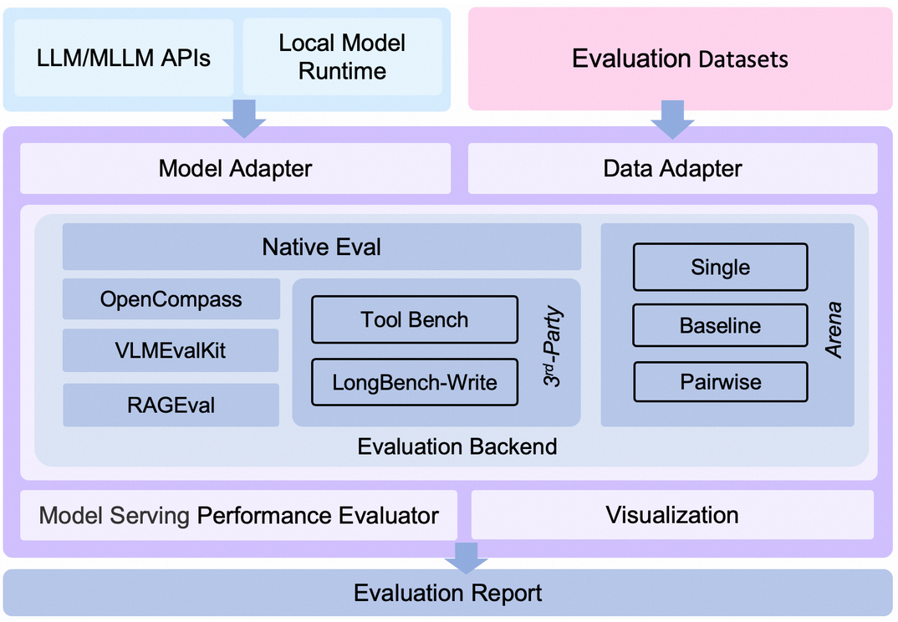
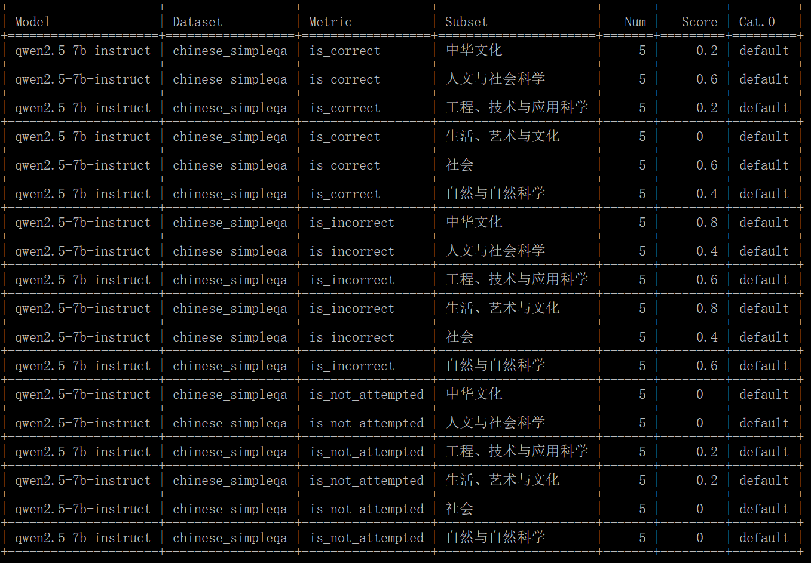

# 六、大模型评估

---

模型评估，旨在评估模型在未曾接触过的数据上的泛化能力及预测精确度，以此更好地理解模型在实际应用场景中的表现。这是模型开发完成后不可或缺的一个环节。对于专注于单一任务的自然语言处理算法而言，通常需要创建一个独立于训练数据的评估数据集，并选用适当的评估指标来预测模型在现实世界中的效能。然而，由于我们无法完全掌握数据的真实分布情况，单纯依赖与训练数据独立且相同分布的方法构建的评估数据集，在许多情形下可能无法全面准确地反映模型的实际状况。例如，即使面对同样的训练数据，采用不同算法或超参数配置所训练出的四个分类器，若未能获取到数据的真实分布或测试数据采样不足，那么这些分类器在实际应用中的表现就难以通过前述评估手段得出的结果准确预测。

在模型评估过程中，通常会使用一系列评估指标（Evaluation Metrics）来衡量模型的表现，如：准确率、精确率、召回率、F1 分数、ROC 曲线和 AUC 等。这些指标根据具体的任务和应用场景可能会有所不同。文本生成任务的评估面临的主要挑战源自语言本身的灵活性和多样性，同一句话可以通过多种方式表达。这种多样性使得文本生成任务的评估变得复杂，因为即使是语义相同但用词差异较大的句子，也可能被错误地视为不正确或低质量的输出。

合理选择评估数据集对于模型评估至关重要。对于单一任务的评估，通常的做法是将数据集划分为训练集、验证集和测试集三部分。训练集用于模型训练，验证集用于模型超参数调整和模型选择，而测试集则用来最终评估模型的表现。为了防止数据泄露，评估数据集应当与训练数据集保持独立。同时，评估数据集需要具备代表性，能够反映模型实际应用中可能遇到的各种数据情况，包括常见的、特殊的以及边缘案例，以确保模型在广泛的条件下都能表现出色。此外，评估数据集的规模也应足够大，以便全面检验模型的性能。

对于大语言模型的评估，不仅涉及数据集的选择问题，还面临着构造评测数据集的挑战，因为这类模型能够在单一框架内完成自然语言理解、逻辑推理、自然语言生成及多语言处理等多项任务。因此，构建既能涵盖各个任务又能反映模型综合能力的评测数据集是一项重要的研究课题。另外，鉴于大语言模型的训练过程包含语言模型预训练、有监督微调和强化学习等多个阶段，每个阶段的目标各不相同，所以对不同阶段的模型也需要采用不同的评估标准和方法，确保每个阶段的发展方向符合预期。总之，无论是小规模还是大规模的语言模型，有效的评估都是确保模型质量和实用性的重要环节。

我们通常从以下几个维度来综合评估LLM的能力：

*   语义理解（Understanding）
*   知识推理（Reasoning）
*   专业能力（e.g. coding、math）
*   应用能力（MedicalApps、AgentApps、AI-FOR-SCI ...）
*   指令跟随（Instruction Following）
*   鲁棒性（Robustness）
*   偏见（Bias）
*   幻觉（Hallucinations）
*   安全性（Safety）

目前评测方法可以分为人工评测和自动评测，其中，自动评测技术相比人工评测来讲，具有效率高、一致性好、可复现、鲁棒性好等特点，逐渐成为业界研究的重点。模型的自动评测技术可以分为Rule-based和Model-based两大类：

*   Rule-based方法：
    *   benchmark以客观题为主，例如多选题，被测的LLM通过理解context/question，来指定最佳答案。
    *   解析LLM的response，与标准答案做对比。
    *   计算metric（accuracy、rouge、bleu等）。
*   Model-based方法：
    *   裁判员模型（e.g. GPT-4、Claude、Expert Models/Reward models）。
    *   LLM Peer-examination。

## 司南（OpenCompass）

OpenCompass 是面向大模型评测的一站式平台。其主要特点如下：

- **开源可复现**：提供公平、公开、可复现的大模型评测方案
- **全面的能力维度**：五大维度设计，提供 70+ 个数据集约 40 万题的的模型评测方案，全面评估模型能力
- **丰富的模型支持**：已支持 20+ HuggingFace 及 API 模型
- **分布式高效评测**：一行命令实现任务分割和分布式评测，数小时即可完成千亿模型全量评测
- **多样化评测范式**：支持零样本、小样本及思维链评测，结合标准型或对话型提示词模板，轻松激发各种模型最大性能
- **灵活化拓展**：想增加新模型或数据集？想要自定义更高级的任务分割策略，甚至接入新的集群管理系统？OpenCompass 的一切均可轻松扩展！

### 4.1.1 安装

pip 安装

```bash
# 激活环境
conda activate Qwen
# 支持绝大多数数据集及模型
pip install -U opencompass

# 完整安装（支持更多数据集）
# pip install "opencompass[full]"

# API 测试（例如 OpenAI、Qwen）
# pip install "opencompass[api]"
```

源码构建

```shell
# 返回LLM目录
cd ~/LLM
# 激活环境
conda activate Qwen
# 下载源码
git clone https://github.com/open-compass/opencompass opencompass
cd opencompass
# 安装
pip install -e .
```

### 首次测试

OpenCompass 支持通过命令行界面 (CLI) 或 Python 脚本来设置配置。对于简单的评估设置，我们推荐使用 CLI；而对于更复杂的评估，则建议使用脚本方式。你可以在examples文件夹下找到更多脚本示例。

```bash
# CLI
opencompass --models hf_internlm2_5_1_8b_chat --datasets demo_gsm8k_chat_gen
# Python 脚本
opencompass examples/eval_chat_demo.py
```

| dataset    | version | metric   | mode | internlm2_5-1_8b-chat-hf |
| ---------- | ------- | -------- | ---- | ------------------------ |
| demo_gsm8k | 1d7fe4  | accuracy | gen  | 50.00                    |

### 客观评估

通过下述命令，下载评测数据集并创建评测脚本。

```shell
# 下载数据集并转换成指定格式
cd ~/LLM/data
mkdir raw
cd raw

git clone "https://github.com/FreedomIntelligence/CMB.git"
cd CMB
unzip "./data/CMB.zip" -d "./data/" 
rm "./data/CMB.zip"

cd ~/LLM/data
cp raw/CMB/CMB-Exam/CMB-test/CMB-test-choice-question-merge.json ./CMB/test.json
cp raw/CMB/CMB-Exam/CMB-val/CMB-val-merge.json ./CMB/val.json

# 使用OpenCompass评测
# 编写脚本 eval_cmb.sh
cd ~/LLM
vim script/eval_cmb.sh

```

评测脚本`eval_cmb.sh`内容如下：

```shell
CUDA_VISIBLE_DEVICES=0 \
python ./opencompass/run.py \
--datasets cmb_gen \
--hf-type chat \
--hf-path /mnt/suke/LLM/model/Qwen2.5-1.5B-Instruct \
--max-out-len 1024 \
--generation-kwargs "do_sample=True temperature=0.3" \
--hf-num-gpus 1 \
--work-dir ./evaluation/dpo \
--debug
```

参数解析：

*   `python ./opencompass/run.py`：调用 Python 解释器来运行 `./opencompass/run.py` 脚本。
*   `--datasets`：这个参数用于定义运行任务中加载和使用的具体数据集。`cmb_gen` 表示在`cmb`数据集上的生成式评测还有`ppl`即判别式评测。
*   `--hf-type`： `HuggingFace`模型类型，可选值为 `chat `或 `base`。
*   `--hf-path`： `HuggingFace`模型路径。
*   `--max-out-len`：生成的最大`token`数，即生成的文本不能超过这个长度限制。
*   `--generation-kwargs`：用于指定生成参数的附加选项。`do_sample=True` 表示启用采样模式而不是贪心搜索，`temperature=0.3` 用于控制生成时的随机性，值越低表示输出更确定，越高表示输出更多样化。。
*   `--hf-num-gpus`：指定用于运行模型的 GPU 的数量。
*   `--work-dir`：保存评估日志和结果的工作目录。在这种情况下，实验结果将保存到 `./evaluation/dpo/{TIMESTAMP}`。

接下来，通过下述命令进行评测：

```shell
bash script/eval_cmb.sh
```

完成评测后会显示评测结果如下：

```shell
| dataset | version | metric | mode | checkpoint-233-merged_hf |
|----- | ----- | ----- | ----- | -----|
| cmb | fb9826 | accuracy | gen | 53.21 |
| cmb_test | fb9826 | accuracy | gen | 0.00 |

```

由于司南框架和数据集的原因，上述输出中，测试集并没有被跑出来，因此我们需要使用自己编写的代码进行评估。

```shell
# 返回LLM目录
cd ~/LLM
# 编写评估代码
vim src/cmb_test_acc.py
# 下载带答案的test数据 CMB-test-choice-answer.json
```

`cmb_test_acc.py`代码如下：

```python
import json
import re
predict_file = open('/mnt/suke/LLM/evaluation/dpo/20250609_014355/predictions/Qwen2.5-1.5B-Instruct_hf/cmb_test.json', 'r', encoding='utf-8')
answer_file = open('/mnt/suke/LLM/data/CMB/CMB-test-choice-answer.json','r', encoding='utf8')
predict_json = json.load(predict_file)
answer_json = json.load(answer_file)
answers = []
for json_obj in answer_json:
    answers.append(json_obj['answer'])
predictions = []
def extract_options(text):
    # 正则表达式匹配只包含字母A到G的选项
    pattern = re.compile(r'[A-F]+')
    options = pattern.findall(text)
    # 使用集合去除重复的选项
    unique_options = set(options)
    # 将集合转换为列表，并转换为大写
    unique_options = sorted([opt for opt in unique_options])
    return unique_options
for key in predict_json.keys():
    prediction = predict_json[key]['prediction']
    prediction = extract_options(prediction)
    prediction = ''.join(prediction)
    predictions.append(prediction)
# upload_file = open('q2_pred.json', 'w', encoding='utf-8')
upload_objs = []
total_acc = 0
for idx, pred in enumerate(predictions):
    upload_objs.append({'id': idx+1, 'model_answer': pred})
    if answers[idx] == pred:
        total_acc += 1
print(f"acc: {total_acc / len(predictions)}")
# json.dump(upload_objs, upload_file, ensure_ascii=False, indent=4)
# upload_file.close()
predict_file.close()
answer_file.close()
```

在测试集上运行评测：

```shell
python src/cmb_test_acc.py

# acc: 0.59
```

## EvalScope

“EvalScope”是魔搭社区倾力打造的模型评测与性能基准测试框架，为您的模型评估需求提供一站式解决方案。无论您在开发什么类型的模型，EvalScope 都能满足您的需求：

- 🧠 大语言模型
- 🎨 多模态模型
- 🔍 Embedding 模型
- 🏆 Reranker 模型
- 🖼️ CLIP 模型
- 🎭 AIGC模型（图生文/视频）

EvalScope 不仅仅是一个评测工具，它是您模型优化之旅的得力助手：

- 🏅 内置多个业界认可的测试基准和评测指标：MMLU、CMMLU、C-Eval、GSM8K 等。
- 📊 模型推理性能压测：确保您的模型在实际应用中表现出色。
- 🚀 与 [ms-swift](https://github.com/modelscope/ms-swift) 训练框架无缝集成，一键发起评测，为您的模型开发提供从训练到评估的全链路支持。



### 安装

#### 方式1. 使用pip安装

1.创建conda环境 (可选)

```
# 建议使用 python 3.10
conda create -n evalscope python=3.10

# 激活conda环境
conda activate evalscope
```

2.pip安装依赖

```shell
pip install evalscope                # 安装 Native backend (默认)
# 额外选项
pip install 'evalscope[opencompass]'   # 安装 OpenCompass backend
pip install 'evalscope[vlmeval]'       # 安装 VLMEvalKit backend
pip install 'evalscope[rag]'           # 安装 RAGEval backend
pip install 'evalscope[perf]'          # 安装 模型压测模块 依赖
pip install 'evalscope[app]'           # 安装 可视化 相关依赖
pip install 'evalscope[all]'           # 安装所有 backends (Native, OpenCompass, VLMEvalKit, RAGEval)
```

#### 方式2. 使用源码安装

使用源码安装可使用最新功能

1.下载源码

```shell
git clone https://github.com/modelscope/evalscope.git
```

2.安装依赖

```shell
cd evalscope/

pip install -e .                  # 安装 Native backend
# 额外选项
pip install -e '.[opencompass]'   # 安装 OpenCompass backend
pip install -e '.[vlmeval]'       # 安装 VLMEvalKit backend
pip install -e '.[rag]'           # 安装 RAGEval backend
pip install -e '.[perf]'          # 安装 模型压测模块 依赖
pip install -e '.[app]'           # 安装 可视化 相关依赖
pip install -e '.[all]'           # 安装所有 backends (Native, OpenCompass, VLMEvalKit, RAGEval)
```

### 简单测评

#### 1.命令行测试

在任意路径下执行`eval`命令：

```shell
evalscope eval \
 --model Qwen/Qwen2.5-0.5B-Instruct \
 --datasets gsm8k arc \
 --limit 5
```

**结果如下：**

| Model                  	      | Dataset | Metric                     | Subset                | Num   | Score  | Cat.0     |
+=========================+=========+==================+================+=======+
| Qwen2.5-0.5B-Instruct   | arc         | AverageAccuracy  | ARC-Easy            |   5        |  0.6     | default  |
| Qwen2.5-0.5B-Instruct   | arc         | AverageAccuracy  | ARC-Challenge   |   5       |  0.4     | default  |
| Qwen2.5-0.5B-Instruct   | gsm8k   | AverageAccuracy  | main                    |   5       |  0.6     | default  |

#### 2.py代码测试

使用python代码进行评测时需要用`run_task`函数提交评测任务，传入一个`TaskConfig`作为参数：

```python
from evalscope.run import run_task

task_cfg = {
    'model': 'Qwen/Qwen2.5-0.5B-Instruct',
    'datasets': ['gsm8k', 'arc'],
    'limit': 5
}

run_task(task_cfg=task_cfg)
```

`--model`: 指定了模型在[ModelScope](https://modelscope.cn/)中的`model_id`，可自动下载，例如[Qwen/Qwen2.5-0.5B-Instruct](https://modelscope.cn/models/Qwen/Qwen2.5-0.5B-Instruct/summary)

；也可使用模型的本地路径，例如`/path/to/model`

`--datasets`: 数据集名称，支持输入多个数据集，使用空格分开，数据集将自动从modelscope下载，支持的数据集参考[数据集列表](https://evalscope.readthedocs.io/zh-cn/latest/get_started/supported_dataset.html#id1)

`--limit`: 每个数据集最大评测数据量，不填写则默认为全部评测，可用于快速验证

**结果与上述相同不再赘述。**

### 复杂测评

若想进行更加自定义的评测，例如自定义模型参数，或者数据集参数，可以使用以下命令，启动评测方式与简单评测一致，下面展示了使用`eval`命令启动评测：

```bash
evalscope eval \
 --model Qwen/Qwen3-0.6B \
 --model-args '{"revision": "master", "precision": "torch.float16", "device_map": "auto"}' \
 --generation-config '{"do_sample":true,"temperature":0.6,"max_new_tokens":512,"chat_template_kwargs":{"enable_thinking": false}}' \
 --dataset-args '{"gsm8k": {"few_shot_num": 0, "few_shot_random": false}}' \
 --datasets gsm8k \
 --limit 10
```

```
+------------+-----------+-----------------+----------+-------+---------+---------+
| Model      | Dataset   | Metric          | Subset   |   Num |   Score | Cat.0   |
+============+===========+=================+==========+=======+=========+=========+
| Qwen3-0.6B | gsm8k     | AverageAccuracy | main     |    10 |     0.3 | default |
+------------+-----------+-----------------+----------+-------+---------+---------+ 
```

### 使用裁判模型主观评价

在评测时，可以使用裁判模型对模型的输出进行评估，此外有些数据集需要使用裁判模型进行评测，例如`simple_qa`数据集，使用以下命令启动评测：

```python
from evalscope import TaskConfig, run_task
from evalscope.constants import EvalType, JudgeStrategy

task_cfg = TaskConfig(
    model='qwen2.5-7b-instruct',
    api_url='https://dashscope.aliyuncs.com/compatible-mode/v1',
    api_key= 'dashscope api-key',
    eval_type=EvalType.SERVICE,
    datasets=[
        # 'simple_qa',
        'chinese_simpleqa',
    ],
    eval_batch_size=5,
    limit=5,
    judge_strategy=JudgeStrategy.AUTO,
    judge_model_args={
        'model_id': 'qwen2.5-72b-instruct',
        'api_url': 'https://dashscope.aliyuncs.com/compatible-mode/v1',
        'api_key': 'dashscope api-key',
    }
)

run_task(task_cfg=task_cfg)
```

结果：



---

